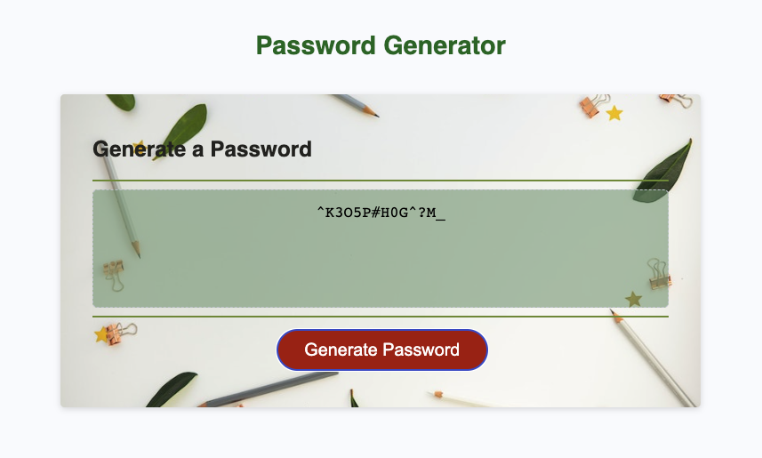

# Password Generator

## Description
This repository holds the source files for a fully functioning password generator app. The password generator takes criteria selected by a user and uses it to generate a random string. The app runs in a browser and features dynamically updated HTML and CSS powered by JavaScript. It has a clean and polished user interface that is responsive.

## Technologies Used
* HTML
* CSS
* JavaScript

## Live Application
https://ladykays.github.io/password-generator/

## Screenshot

### Credits
Photo by <a href="https://unsplash.com/ja/@joannakosinska?utm_source=unsplash&utm_medium=referral&utm_content=creditCopyText">Joanna Kosinska</a> on <a href="https://unsplash.com/wallpapers/design?utm_source=unsplash&utm_medium=referral&utm_content=creditCopyText">Unsplash</a>

## Licence
Please refer to the LICENCE in the repository
  
  
  